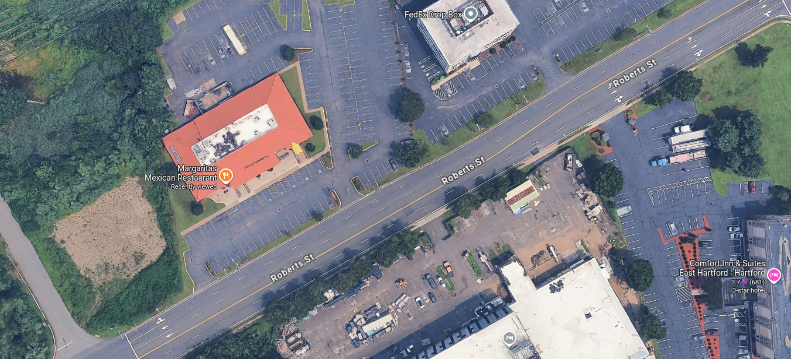

# East Hartford Sexual Assault

<figure>
  
  <figcaption>The Location of the incident, alleged to be the Margarita's restaurant parking lot.</figcaption>
</figure>

A 23-year-old woman was sexually assaulted by an Uber driver at 4:00 AM on Saturday 29 March, 2025 in a restaurant's parking lot in East Hartford, Connecticut.

Just 30 seconds into the ride, the driver Isaac Boafa jumped over the seats and on top of her, grabbed her pants and started to sexually assault her, she punched him 3 times to push him away.

She got out of the car and ran off with Boafo allegedly speeding off out of the parking lot. She then waited near the restaurant and called a second Uber, the driver told her to call 911. The second uber driver later told the police the woman looked scared and claimed she was raped.

Police investigations found that the description of the suspect matched the driver’s picture provided in the Uber app. Officers found Boafo’s car in town the next day and arrested him. He claimed that the woman was “intoxicated, crying and very aggressive.”

Police sent Boafo’s fingernail clippings and scrapings for DNA testing. He appeared in Manchester court, on Monday 31, March, 2025 and has been charged with first degree sexual assault and disorderly conduct. His DNA is being tested.

**Source:**
[WFSB - Channel 3 Eyewitness News Article](https://www.wfsb.com/2025/03/31/uber-driver-accused-sexually-assaulting-woman-margaritas-parking-lot/)
